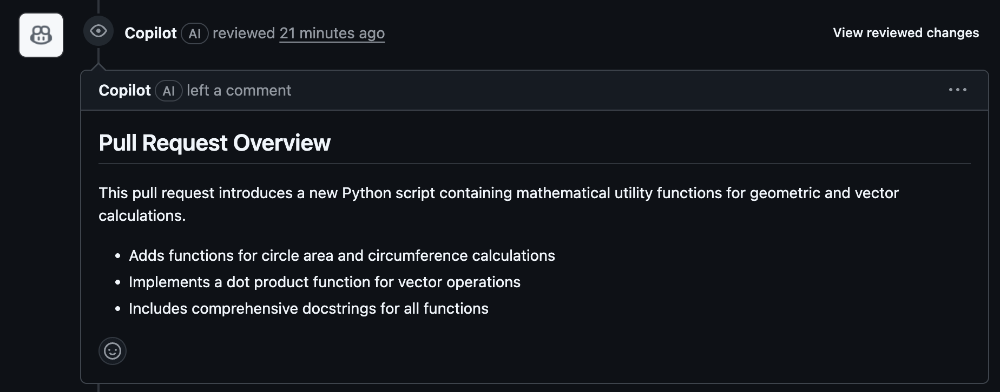
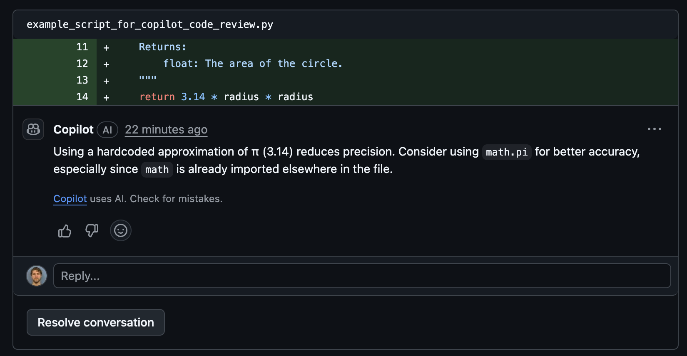
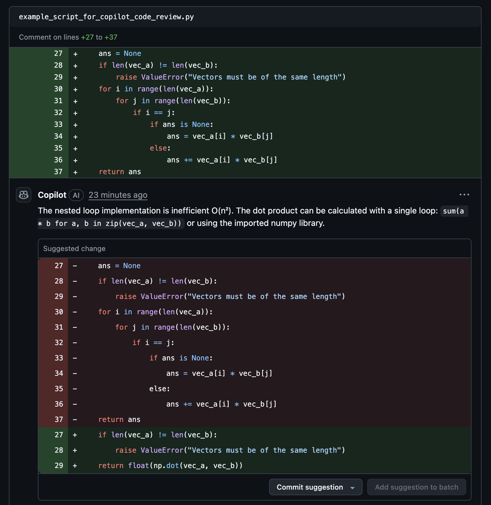
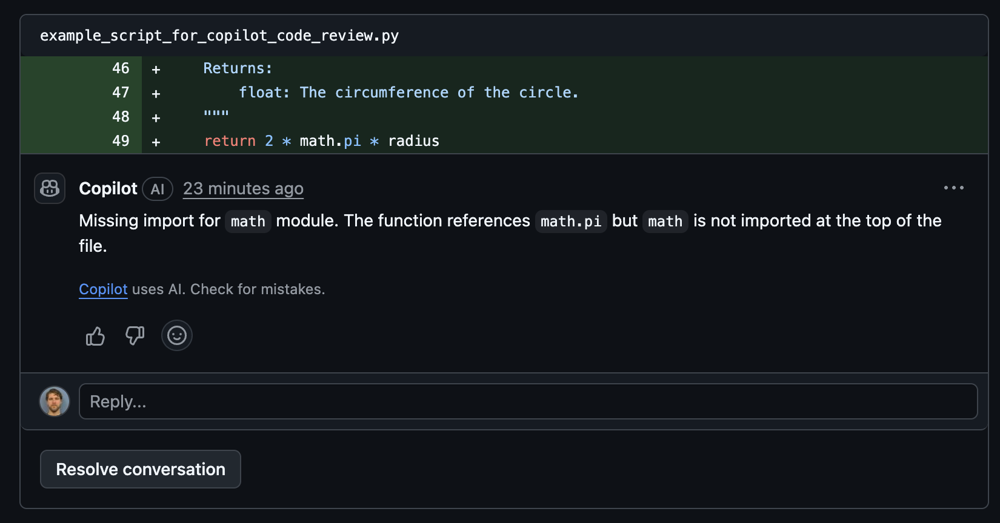

# Github Copilot Features

## Summary

GitHub Copilot is an AI-powered coding assistant integrated into Visual Studio Code. It provides code suggestions, explanations, and automated implementations based on natural language prompts and existing code context. Copilot has been trained on public code repositories and can assist with most programming languages and frameworks.

## Setup

### Download VSCode (macOS)

1. Go to the website and download for your appropriate computer system
    * https://code.visualstudio.com/
2. Open the downloaded file
3. Activate Temporary SUDO Access (if necessary)
    * Go to Self Service
    * Click "All"
    * Click "MakeMeAdmin"
4. Drag VSCode from "Downloads" to "Applications"
5. Open VSCode

### Configure Github Copilot

1. Click on the Github Copilot button in the bottom right of VSCode and then click "Sign in to Use Copilot"
    * 
2. Sign in using Github
3. This will direct you to sign in through a browser

### Clone Repo and Open in VSCode
1. In the VSCode terminal navigate to the folder you want to contain your repository
2. Clone the repository
    * `git clone https://github.com/tchase56/github_copilot_demo.git`
3. In the VSCode File Explorer and select the cloned repository folder (github_copilot_demo)
    * 

### Set Up Python Environment

1. install UV in your system (macOS)
    * `brew install astral-sh/uv/uv`
2. Create virtual environment
    * `uv venv --python 3.11`
3. Activate virtual environment
    * `source .venv/bin/activate`
4. Install dependencies from uv.lock
    * `uv sync`

## Core Capabilities

### Code Completions

* Copilot provides inline code suggestions as you type, ranging from single line completions to entire function implementations. With next edit suggestions, it predicts the next logical code change based on your current context.

* Example
    * One of my favorite uses of this capability is that if I write a class or function in python and I include type hinting properly, I can autocomplete my entire docstring 

* Demo
    * If you'd like to start completely from scratch delete the version of add_floats() in codeComplete.py that already has the docstring. 
    * In codeComplete.py start typing your docstring and it should provide an option to autocomplete, you can accept the changes by clicking "tab". 
    * 

### Autonomous Coding

* VS Code and agent mode can autonomously plan and execute complex development tasks, coordinating multi-step workflows that involve running terminal commands or invoking specialized tools. 
* It can transform high-level requirements into working code.

* Example
    * One of my favorite uses of this capability is to highlight modular sections of my code and have an agent write unit tests (pytests). 

* Demo
    * If you'd like to recreate this demo, delete test_codeComplete.py. 
    * In codeComplete.py highlight the add_floats() function, then scroll over to the github copilot "CHAT" and type "Write pytests for this function". 
        * The highlighted function will be added as context to the LLM prompt. 
    * Github Copilot creates a set of pytests for the add_floats() function in a new file called "test_codeComplete.py". 
        * Click the checkmark to accept the changes suggested by Github Copilot. 
    * 

### Natural Language Chat

* Use natural language to interact with your codebase through chat interfaces. 
    * Ask questions, request explanations, or specify code changes using conversational prompts.
    * Apply changes across multiple files in your project using single prompts. 
    * Copilot analyzes your project structure and makes coordinated modifications.

* Examples
    * "How does authentication work in this project?"
    * "What's causing the memory leak in the data processing function?"

* Demo
    * In test_codeComplete.py highlight the test_add_floats_precision() pytest and ask, "I don't fully understand this pytest. Can you explain it in detail?".
    * We can also ask follow ups such as, "What would happen without pytest.approx?". 
    * 

### Smart Actions

* VS Code has many predefined actions for common development tasks that are enhanced with AI capabilities and integrated into the editor.
    * From helping you write commit messages or pull requests descriptions, renaming code symbols, fixing errors in the editor, to semantic search that helps you find relevant files.

* Demo
    * If I add my generated pytests in test_codeComplete.py to the staged changes in the "Source Control" tab in VSCode I can click on the "generate commit message" button that looks like two stars. 
        * This will look at my staged changes and automatically suggest a relevant commit message. 
    * 

## Vibe Coding a Simple Video Game

### Writing a Simple Video Game

* If you want to recreate from scratch delete "minimalist_snake.py". 
* Go to the Github Copilot CHAT window and type, "Can you write a very simple minimalist video game in a new python file?". 
    * 
    * This is an example of the autonomous coding feature. 
* In the Github Copilot CHAT window type, "Can you explain this code in detail?". 
    * 
    * 
    * This is an example of the natural language chat feature. 
* Gameplay image "Snake"
    * 
        * This is an image of snake travelling downwards next to a piece of food.
* Bonus gameplay image "Space Invaders" (similarly vibe coded)
    * 
        * This is an image of the space invaders (M's) being shot at by the space ship (A). You can see a missed bullet (|) flying by the invaders. 

## Copilot Code Review

### Intro

Generally when you merge into a branch (such as main) you create a pull request and assign a reviewer to look at the changes to ensure there are not going to be any issues. In some cases only one person may be working on a repo, or in other cases there may be man power constraints that make extensive code review prohibitively painful. But Github Copilot is here to make our lives easier in this sense as well. We can have a Github Copilot agent conduct code reviews and suggest changes on pull requests.

* Types of Repository Custom Instructions
    * Repository-wide custom instructions
        * apply to all requests made in the context of a repository
        * Supported by: Copilot Chat, Copilot coding agent, and Copilot code review
        * specified in .github/copilot-instructions.md
    * Path-specific custom instructions
        * apply to requests made in the context of files that match a specified path
        * Supported by: Copilot coding agent, and Copilot code review
        * these are specified in one or more `NAME.instructions.md` files within `.github/instructions` directory in the repository. 
        * You can find more details in the following link
            * https://docs.github.com/en/copilot/how-tos/configure-custom-instructions/add-repository-instructions#creating-path-specific-custom-instructions-1
        * If the path you specify matches a file that Copilot is working on, and a repository-wide custom instructions file also exists, then the instructions from both files are used. 
    * Agent instructions 
        * used by AI agents
        * Supported by: Copilot coding agent
        * You can create one of more `AGENTS.md` files, stored anywhere within the repository. 
            * When Copilot is working, the nearest `AGENTS.md` file in the directory tree will take precedence. 

### Setup

1. On our branch of interest click "Settings" at the top, select "Copilot" on the left, and lastly click on "Code review".
2. Create a ruleset for when code review should be done. 
    * In our case we will do a code review if the user has access to copilot and if we are doing a pull request to main. 
    * 
        * name ruleset
        * set it to active
        * set target branch
    * 
        * toggle "review draft pull requests"
3. If "Use custom instructions when reviewing pull requests" is not toggled on
    * by default it will check for
        1. Code Quality & Readability
        2. Correctness & Bugs
        3. Security & Safety
        4. Performance
        5. Best Practices & Style
        6. Documentation & Maintainability
3. If custom instructions are desired, under "General settings" toggle on "Use custom instructions when reviewing pull requests". 
    * 
    *  Create repository-wide custom instructions
        * Ask Copilot coding agent to generate `copilot-instructions.md` file
            1. https://docs.github.com/en/copilot/how-tos/configure-custom-instructions/add-repository-instructions#asking-copilot-coding-agent-to-generate-a-copilot-instructionsmd-file
        * Writing your own `copilot-instructions.md` file
            1. In the root of your repository, create a file named `.github/copilot-instructions.md`.
                * Create the `.github` directory if it does not already exist.
            2. Add natural language instructions to the file, in Markdown format.
                * Whitespace between instructions is ignored, so the instructions can be written as a single paragraph, each on a new line, or separated by blank lines for legibility.


### Examples

In the below code we have a few problems that hopefully our Copilot code reviewer can help with. 

* Problems of interest
    1. numpy is imported but is not used
    2. a hard coded and low precision version of pi is used
    3. the dot product function is suboptimal
    4. the math library is used but not imported

```
import numpy as np


def area_circle(radius: float) -> float:
    """
    Calculate the area of a circle given its radius.
    
    Args:
        radius (float): The radius of the circle.
    
    Returns:
        float: The area of the circle.
    """
    return 3.14 * radius * radius

def dot_product(vec_a: list[float], vec_b: list[float]) -> float:
    """
    Calculate the dot product of two vectors.

    Args:
        vec_a (list of float): The first vector.
        vec_b (list of float): The second vector.

    Returns:
        float: The dot product of the two vectors.
    """
    ans = None
    if len(vec_a) != len(vec_b):
        raise ValueError("Vectors must be of the same length")
    for i in range(len(vec_a)):
        for j in range(len(vec_b)):
            if i == j:
                if ans is None:
                    ans = vec_a[i] * vec_b[j]
                else:
                    ans += vec_a[i] * vec_b[j]
    return ans

def circumference_circle(radius: float) -> float:
    """
    Calculate the circumference of a circle given its radius.

    Args:
        radius (float): The radius of the circle.

    Returns:
        float: The circumference of the circle.
    """
    return 2 * math.pi * radius
```

* Copilot Code Review
    * Changes are summarized
        * 
    * Problems Captured
        * 
            * (problem 2) a hard coded and low precision version of pi is used
        * 
            * (problem 1) numpy imported but not used
            * (problem 3) the dot product function is suboptimal
        * 
            * (problem 4) the math library is used but not imported
    


# References

* https://code.visualstudio.com/docs/copilot/overview
* https://docs.github.com/en/copilot/how-tos/configure-custom-instructions/add-repository-instructions