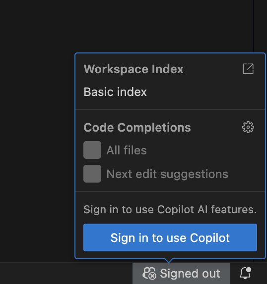
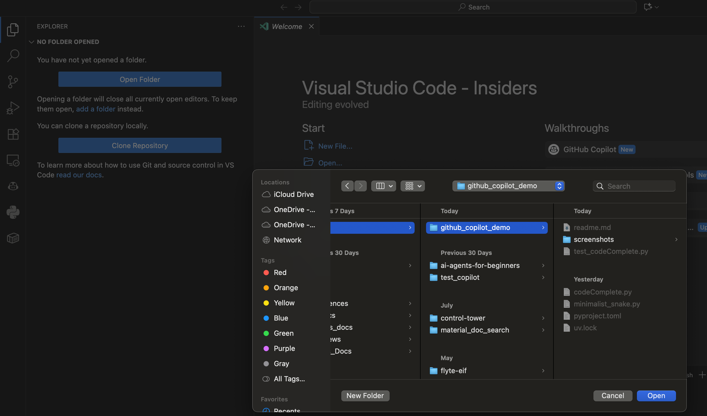
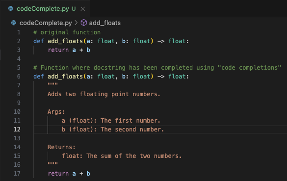
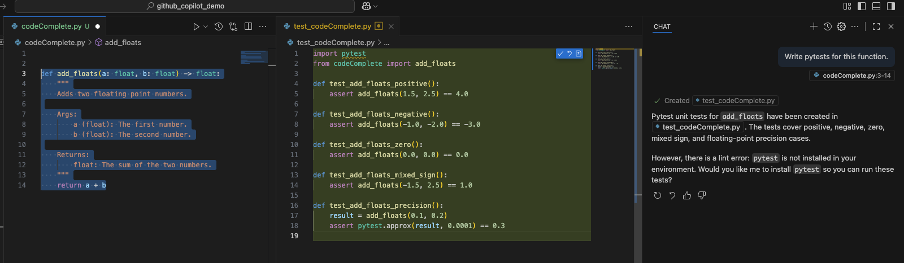
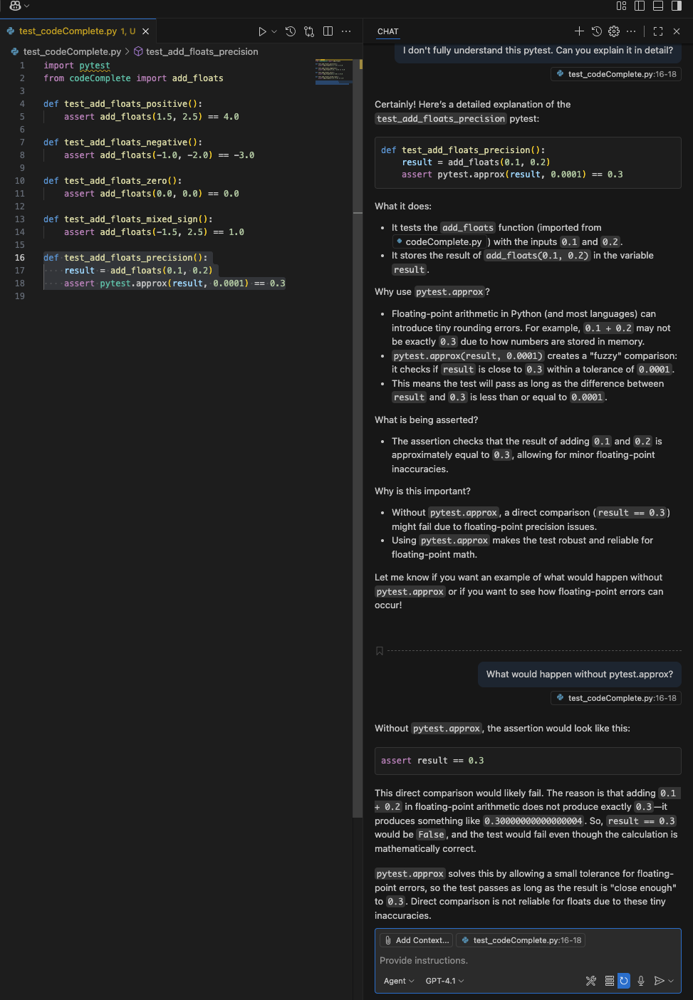
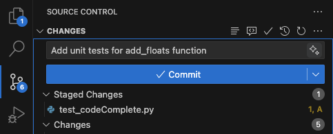
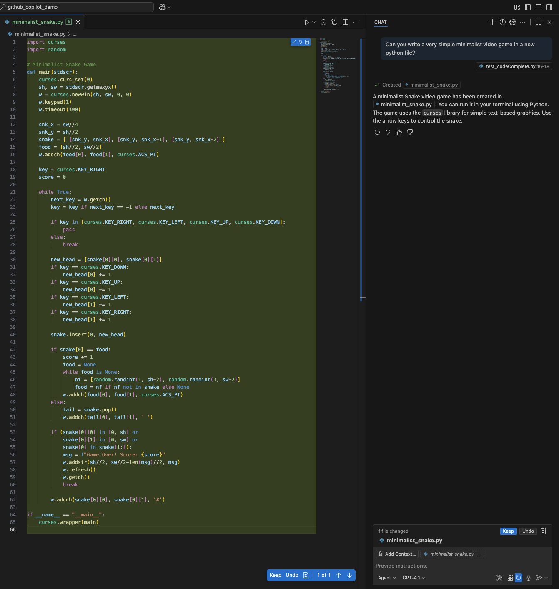
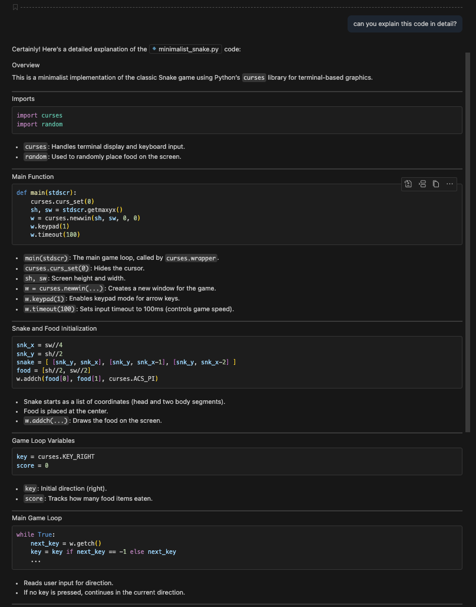
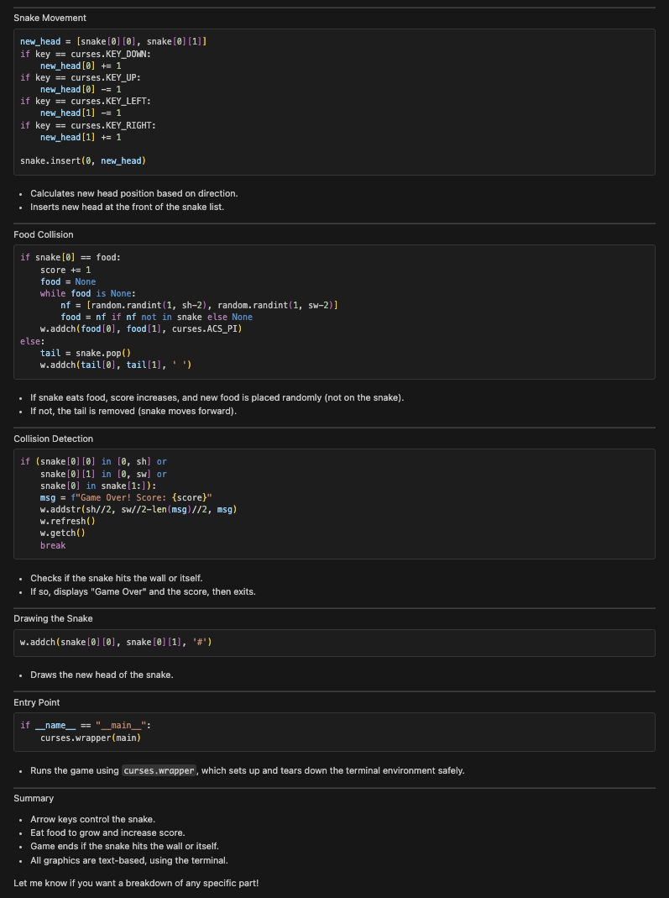

# Github Copilot Features

## Summary

GitHub Copilot is an AI-powered coding assistant integrated into Visual Studio Code. It provides code suggestions, explanations, and automated implementations based on natural language prompts and existing code context. Copilot has been trained on public code repositories and can assist with most programming languages and frameworks.

## Setup

### Download VSCode (macOS)

1. Go to the website and download for your appropriate computer system
    * https://code.visualstudio.com/
2. Open the downloaded file
3. Activate Temporary SUDO Access
    * Go to Fortune Brands Innovations Self Service
    * Click "All"
    * Click "MakeMeAdmin"
4. Drag VSCode from "Downloads" to "Applications"
5. Open VSCode

### Configure Github Copilot

1. Click on the Github Copilot button in the bottom right of VSCode and then click "Sign in to Use Copilot"
    * 
2. Sign in using Github
3. This will direct you to sign in through a browser

### Clone Repo and Open in VSCode
1. In the VSCode terminal navigate to the folder you want to contain your repository
2. Clone the repository
    * `git clone https://github.com/FloTechnologiesData/github_copilot_demo.git`
3. In the VSCode File Explorer and select the cloned repository folder (github_copilot_demo)
    * 

### Set Up Python Environment

1. install UV in your system (macOS)
    * `brew install astral-sh/uv/uv`
2. Create virtual environment
    * `uv venv --python 3.11`
3. Activate virtual environment
    * `source .venv/bin/activate`
4. Install dependencies from uv.lock
    * `uv sync`

## Core Capabilities

### Code Completions

* Copilot provides inline code suggestions as you type, ranging from single line completions to entire function implementations. With next edit suggestions, it predicts the next logical code change based on your current context.

* Example
    * One of my favorite uses of this capability is that if I write a class or function in python and I include type hinting properly, I can autocomplete my entire docstring 

* Demo
    * If you'd like to start completely from scratch delete the version of add_floats() in codeComplete.py that already has the docstring. 
    * In codeComplete.py start typing your docstring and it should provide an option to autocomplete, you can accept the changes by clicking "tab". 
    * 

### Autonomous Coding

* VS Code and agent mode can autonomously plan and execute complex development tasks, coordinating multi-step workflows that involve running terminal commands or invoking specialized tools. 
* It can transform high-level requirements into working code.

* Example
    * One of my favorite uses of this capability is to highlight modular sections of my code and have an agent write unit tests (pytests) for me. 

* Demo
    * If you'd like to recreate this demo, delete test_codeComplete.py. 
    * In codeComplete.py highlight the add_floats() function, then scroll over to the github copilot "CHAT" and type "Write pytests for this function". 
        * The highlighted function will be added as context to the LLM prompt. 
    * Github Copilot creates a set of pytests for the add_floats() function in a new file called "test_codeComplete.py". 
        * Click the checkmark to accept the changes suggested by Github Copilot. 
    * 

### Natural Language Chat

* Use natural language to interact with your codebase through chat interfaces. 
    * Ask questions, request explanations, or specify code changes using conversational prompts.
    * Apply changes across multiple files in your project using single prompts. 
    * Copilot analyzes your project structure and makes coordinated modifications.

* Examples
    * "How does authentication work in this project?"
    * "What's causing the memory leak in the data processing function?"
    * "Add error handling to the payment processing service"

* Demo
    * In test_codeComplete.py highlight the test_add_floats_precision() pytest and ask, "I don't fully understand this pytest. Can you explain it in detail?".
    * We can also ask follow ups such as, "What would happen without pytest.approx?". 
    * 

### Smart Actions

* VS Code has many predefined actions for common development tasks that are enhanced with AI capabilities and integrated into the editor.
    * From helping you write commit messages or pull requests descriptions, renaming code symbols, fixing errors in the editor, to semantic search that helps you find relevant files.

* Demo
    * If I add my generated pytests in test_codeComplete.py to the staged changes in the "Source Control" tab in VSCode I can click on the "generate commit message" button that looks like two stars. 
        * This will look at my staged changes and automatically suggest a relevant commit message. 
    * 

## Vibe Coding a Simple Video Game

### Writing a Simple Video Game

* If you want to recreate from scratch delete "minimalist_snake.py". 
* Go to the Github Copilot CHAT window and type, "Can you write a very simple minimalist video game in a new python file?". 
    * 
    * This is an example of the autonomous coding feature. 
* In the Github Copilot CHAT window type, "Can you explain this code in detail?". 
    * 
    * 
    * This is an example of the natural language chat feature. 
* Gameplay image
    * 
        * This is an image of snake travelling downwards next to a piece of food.

# References

* https://code.visualstudio.com/docs/copilot/overview