# GitHub Copilot Tutorial (Accelerate Your Software Developement)

## Summary

GitHub Copilot is an AI-powered coding assistant integrated into Visual Studio Code (and many other IDEs). It provides code suggestions, explanations, and automated coding based on natural language prompts and existing code context. Copilot has been trained on public code repositories and can assist with most programming languages and frameworks. Utilization of GitHub Copilot can increase your software development efficiency dramatically.

AI coding assistants like GitHub Copilot are becoming increasingly necessary to stay competitive in today's job market. With some companies firing developers who refused to use these tools.

## Setup

### Download VSCode (macOS)

1. Go to the website and download for your appropriate computer system
    * https://code.visualstudio.com/
2. Open the downloaded file
3. Activate Temporary SUDO Access (if necessary)
    * Go to Self Service
    * Click "All"
    * Click "MakeMeAdmin"
4. Drag VSCode from "Downloads" to "Applications"
5. Open VSCode

### Configure GitHub Copilot

1. Click on the GitHub Copilot button in the bottom right of VSCode and then click "Sign in to Use Copilot"
    * 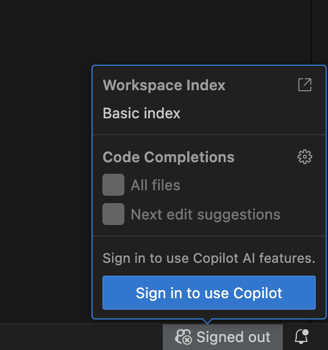
2. Sign in using GitHub
3. This will direct you to sign in through a browser

### Clone Repo and Open in VSCode
1. In the VSCode terminal navigate to the folder you want to contain your repository
2. Clone the repository
    * `git clone https://github.com/tchase56/github_copilot_demo.git`
3. In the VSCode File Explorer select the cloned repository folder (github_copilot_demo)
    * 

### Set Up Python Environment

1. install UV in your system (macOS)
    * `brew install astral-sh/uv/uv`
2. Create virtual environment
    * `uv venv --python 3.11`
3. Activate virtual environment
    * `source .venv/bin/activate`
4. Install dependencies from uv.lock
    * `uv sync`

## GitHub Copilot Configurations

### Modes

#### Ask

Ask mode acts as a conversational assistant for quick help, explanations, and/or code snippets that don't directly modify your workspace files. It is useful for understanding complex code, learning new concepts, brainstorming ideas, or getting general programming advice.

#### Agent

This is the most autonomous mode where Copilot acts as an intelligent peer programmer. You give it a high level goal, and then it analyzes the codebase, plans the steps, makes edits across multiple files, runs terminal commands/tests, and iterates until the task is complete. It is useful for complex, open ended tasks, refactoring large parts of a project, or migrating legacy code. 

#### Plan

Before executing complex tasks in agent mode, this feature allows you to review and approve the step-by-step blueprint that Copilot intends to follow providing a layer of oversight.

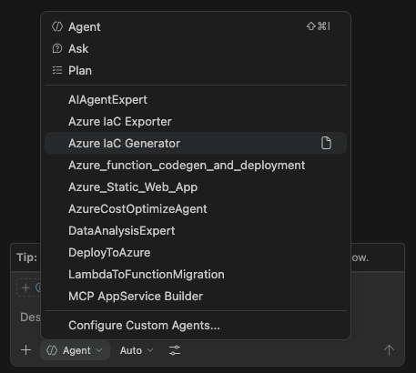

### LLM Models

#### Auto

This mode chooses the LLM dynamically and offers a 10% discount. It strives to pick the most appropriate and cheapest model for a task. 

#### 0x Models

These models are free and do not contribute to the premium request limit. 

Models include:
* GPT-4.1
* GPT-4o
* GPT-5 mini

#### 0.25x Models

These models use one-quarter of a standard request credit (one request credit is equivalent to 4 cents).

Models include: 
* Grok Code Fast 1

#### 0.33x Models

These models use one-third of a standard request credit (one request credit is equivalent to 4 cents).

Models include: 
* Claude Haiku 4.5
* Gemini 3 Flash
* GPT-5.4 mini

#### 1x Models

These models use one standard request credit (one request credit is equivalent to 4 cents).

Models include: 
* Claude Sonnet 4
* Claude Sonnet 4.6
* GPT-5.4
* Claude Sonnet 4.5
* Gemini 2.5 Pro
* Gemini 3.1 Pro
* GPT-5.2
* GPT-5.2-Codex
* GPT-5.3-Codex

#### 3x Models

These models use three standard request credits (one request credit is equivalent to 4 cents).

Models include: 
* Claude Opus 4.6
* Claude Opus 4.5

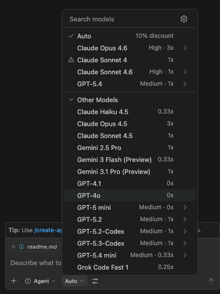


## Core Capabilities

### Code Completions

* Copilot provides inline code suggestions as you type, ranging from single line completions to entire function implementations. With inline code suggestions, GitHub Copilot predicts the next logical code chunk based on your current context.

* Examples
    * Writing a simple function from a comment
    * Writing a docstring for an existing function or class

* Demo
    * Write a simple function from a comment
        * In codeComplete.py start typing your function below the comment and it should provide an option to autocomplete. You can accept the changes by hitting tab, or by clicking accept next to the completion. 
        * 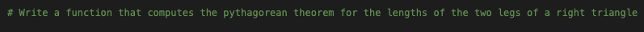
        * 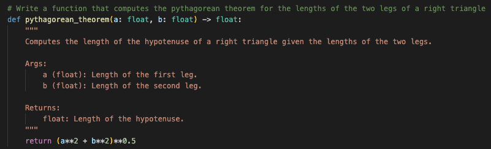


    * Write a docstring for an existing function or class
        * In codeComplete.py start typing your docstring and it should provide an option to autocomplete. You can accept the changes by hitting "tab", or by clicking accept next to the completion. 
        * 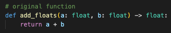
        * 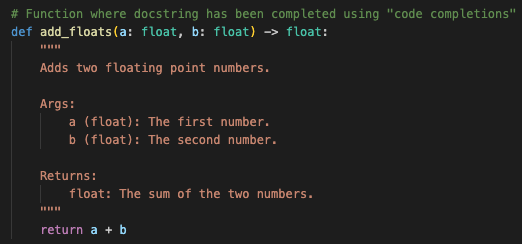


### Autonomous Coding

VS Code and agent mode can autonomously plan and execute complex development tasks, coordinating multi-step workflows that involve running terminal commands or invoking specialized tools. It can transform high-level requirements into working code.

* Example
    * One of my favorite uses of this capability is to highlight modular sections of my code and have an agent write unit tests (pytests). 

* Demo
    * If you'd like to recreate this demo, delete test_codeComplete.py. 
    * Ensure your GitHub Copilot chat is in "Agent" mode. 
    * In codeComplete.py highlight the add_floats() function, then scroll over to the GitHub Copilot "CHAT" and type "Write pytests for this function". 
        * The highlighted function will be added as context to the LLM prompt. 
    * GitHub Copilot creates a set of pytests for the add_floats() function in a new file called "test_codeComplete.py". 
        * Click the checkmark to accept the changes suggested by GitHub Copilot. 
    * 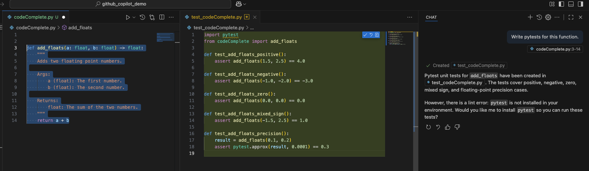

### Natural Language Chat

Use natural language to interact with your codebase through chat interfaces. 
* Ask questions, request explanations, or specify code changes using conversational prompts.

* Examples
    * What is this part of the function/class doing?
    * How can I make this section of my code run faster?

* Demo
    * Ensure your GitHub Copilot is in "Ask" mode
    * In test_codeComplete.py highlight the test_add_floats_precision() pytest and ask, "I don't fully understand this pytest. Can you explain it in detail?".
    * We can also ask follow ups such as, "What would happen without pytest.approx?". 
    * 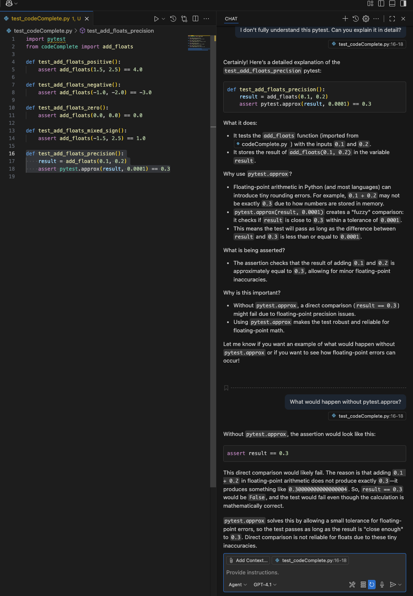

### Smart Actions

VS Code has many predefined actions for common development tasks that are enhanced with AI capabilities and integrated into the editor. From helping you write commit messages or pull requests descriptions, renaming code symbols, fixing errors in the editor, to semantic search that helps you find relevant files.

* Demo
    * If I add my generated pytests in test_codeComplete.py to the staged changes in the "Source Control" tab in VSCode I can click on the "generate commit message" button that looks like two stars. 
        * This will look at my staged changes and automatically suggest a relevant commit message. 
    * 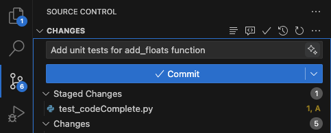

## Advanced Features

### Slash Commands

Slash commands in GitHub Copilot are predefined instructions starting with a "/" that allow rapid access to specific AiI functionalities in the Chat. 

Examples: 
* `/fix`: Propose a fix for the selected code
* `/explain`: provides a detailed explanation of the selected code
* `/tests`: generates unit tests for the selected code

You can also Create custom slash commands. These commands need a yaml header with a name and description. They also need so be saved in `.github/prompts` and they need to have a `.prompt` suffix. 

Examples to be used later in this demo: 
* `/game_description`: walks user through creating a detailed description for simple arcade game they would like to create
* `/implement_space_invaders`: Creates a simple version of space invaders using the curses library

### Custom Instructions

You can configure github copilot to follow custom instructions. These instructions can exist at the personal level, the repository level, or the organization level. In our example here we will focus on the repository level. 

Any instructions you would like GitHub Copilot to follow should be placed in the following document: `.github/copilot-instructions.md`

In the screenshot below we can see instruction that require copilot generated code to:
* generate docstrings
* follow the Google docstring convention
* include type hinting

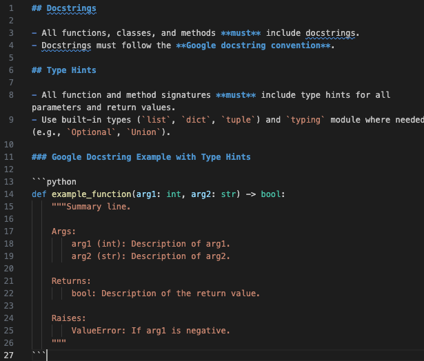

If you want custom instructions only for specific file types this is also supported via apply to glob patterns placed at the top of the instructions. 

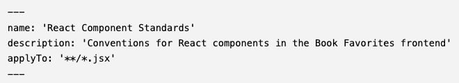

And the instructions file must be in the appropriate location with the appropriate suffix. They should be in the `.github/instructions` folder with the `.instructions` suffix. 

For example: 
`.github/instructions/react.instructions.md`

If you would like github copilot to manually walk you through the process of generating custom instructions, make sure your GitHub Copilot chat is in "Agent" mode and type `/create-instructions`. If you want to verify which instructions are active you can check by typing `/instructions` into your GitHub Copilot chat. 


## Autonomous Coding Example

### Vibe Coding a Simple Video Game

We can easily generate code by having a conversation with GitHub Copilot chat in agent mode. But we are going to do this in a way that is more explicit, generates documentation that we can review/iterate on, and will be less error prone. 

1. If you want to recreate everything from scratch delete the following files
    * `space_invaders.md`
    * `implement_space_invaders.prompt.md`
    * `space_invaders.py`
2. Use the `/game_description` slash command to generate a description for the game that we want to code. 
    * 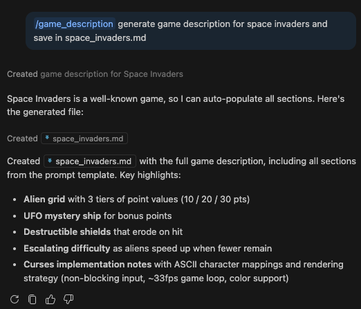
        * This is a prompt that will help a user plan out their game and save the detailed description. 
            * If the game is already well known it will auto populate the details. 
        * In our example it creates a detailed game description in `space_invaders.md`
3. Create a blank `implement_space_invaders.prompt.md` that we will populate with our detailed implementation instructions. 
4. Use "Agent" mode to create a detailed prompt to implement the space invaders game. 
    * 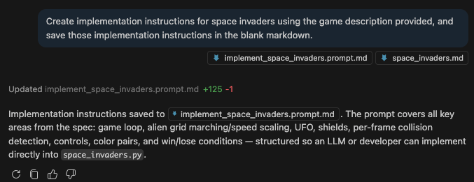
        * Give the chat `space_invaders.md` and the blank `implement_space_invaders.prompt.md` files by opening these files, then selecting the "+" button in the chat to ensure they are in the context of our prompt. 
        * This creates the prompt that we will use to create our game: `implement_space_invaders.prompt.md`
5. Finally we generate our game using `implement_space_invaders.prompt.md`
    * 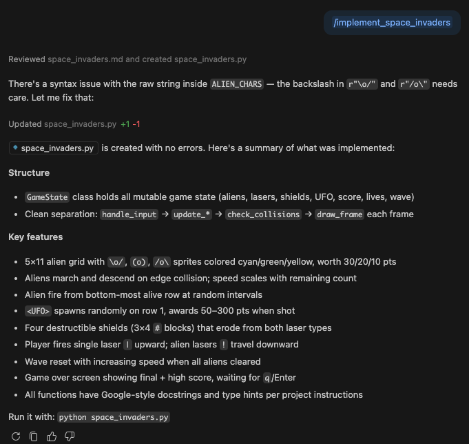

In the future if bugs come up or if we have to generate additional features we have the advantage of having the game description (`space_invaders.md`) and the exact prompt that was used to create the game (`.github/prompts/implement_space_invaders.prompt.md`) pushed to our repo. 

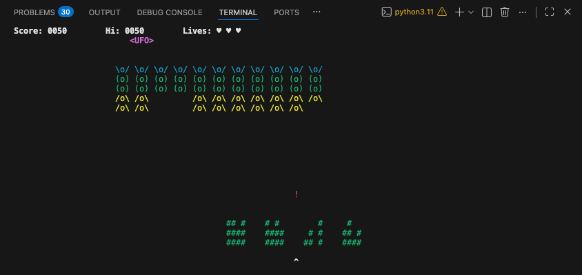


## Copilot Code Review

### Intro

Generally when you merge into a branch (such as main) you create a pull request and assign a reviewer to look at the changes to ensure there are not going to be any issues. In some cases only one person may be working on a repo, or in other cases there may be man power constraints that make extensive code review prohibitively painful. But GitHub Copilot is here to make our lives easier in this sense as well. We can have a GitHub Copilot agent conduct code reviews and suggest changes on pull requests.

### Setup

1. On our branch of interest click "Settings" at the top, select "Copilot" on the left, and lastly click on "Code review".
2. Create a ruleset for when code review should be done. 
    * In our case we will do a code review if the user has access to copilot and if we are doing a pull request to main. 
    * 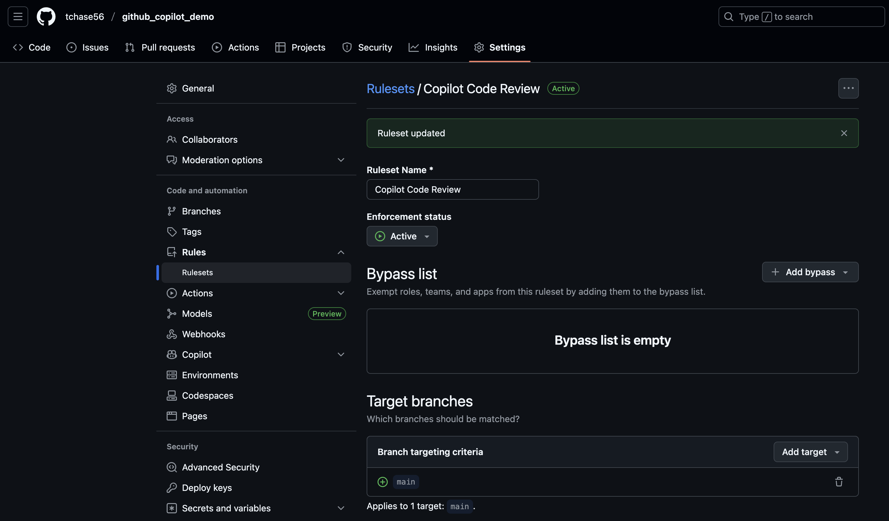
        * name ruleset
        * set it to active
        * set target branch
    * 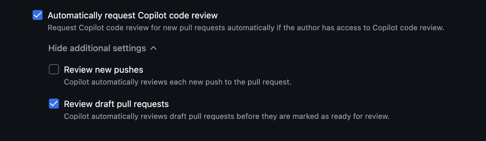
        * toggle "review draft pull requests"
3. If "Use custom instructions when reviewing pull requests" is not toggled on
    * by default it will check for
        1. Code Quality & Readability
        2. Correctness & Bugs
        3. Security & Safety
        4. Performance
        5. Best Practices & Style
        6. Documentation & Maintainability

### Examples

In the below code we have a few problems that hopefully our Copilot code reviewer can help with. 

* Problems of interest
    1. numpy is imported but is not used
    2. a hard coded and low precision version of pi is used
    3. the dot product function is suboptimal
    4. the math library is used but not imported

```
import numpy as np


def area_circle(radius: float) -> float:
    """
    Calculate the area of a circle given its radius.
    
    Args:
        radius (float): The radius of the circle.
    
    Returns:
        float: The area of the circle.
    """
    return 3.14 * radius * radius

def dot_product(vec_a: list[float], vec_b: list[float]) -> float:
    """
    Calculate the dot product of two vectors.

    Args:
        vec_a (list of float): The first vector.
        vec_b (list of float): The second vector.

    Returns:
        float: The dot product of the two vectors.
    """
    ans = None
    if len(vec_a) != len(vec_b):
        raise ValueError("Vectors must be of the same length")
    for i in range(len(vec_a)):
        for j in range(len(vec_b)):
            if i == j:
                if ans is None:
                    ans = vec_a[i] * vec_b[j]
                else:
                    ans += vec_a[i] * vec_b[j]
    return ans

def circumference_circle(radius: float) -> float:
    """
    Calculate the circumference of a circle given its radius.

    Args:
        radius (float): The radius of the circle.

    Returns:
        float: The circumference of the circle.
    """
    return 2 * math.pi * radius
```

* Copilot Code Review
    * Changes are summarized
        * 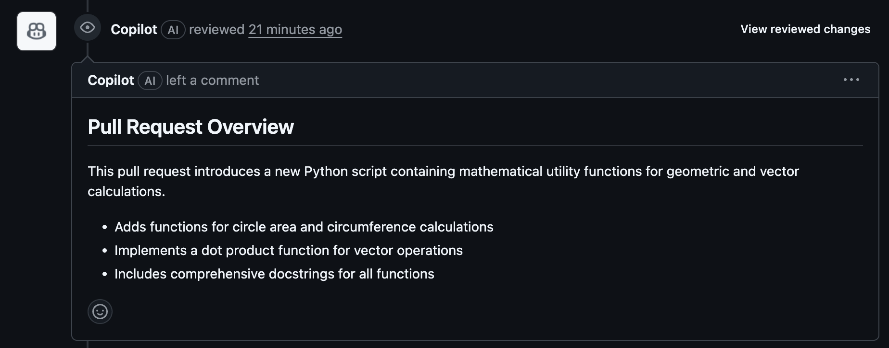
    * Problems Captured
        * 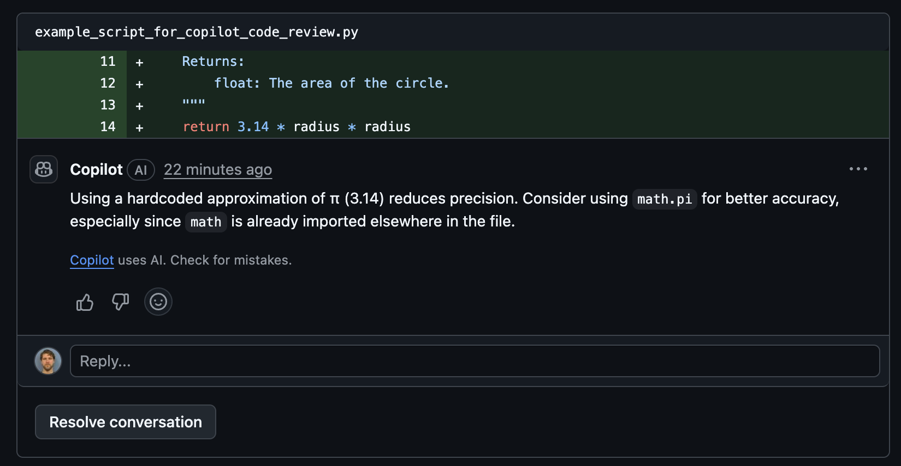
            * (problem 2) a hard coded and low precision version of pi is used
        * 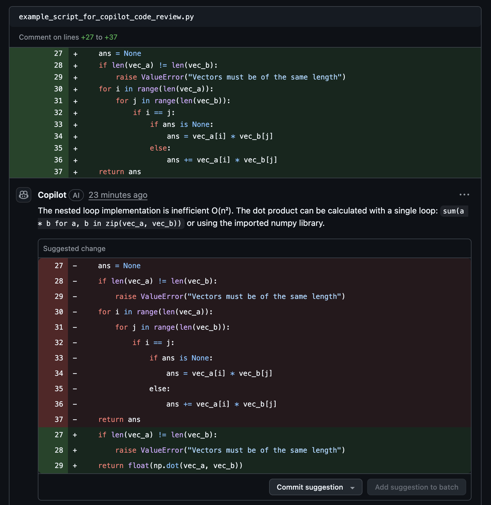
            * (problem 1) numpy imported but not used
            * (problem 3) the dot product function is suboptimal
        * 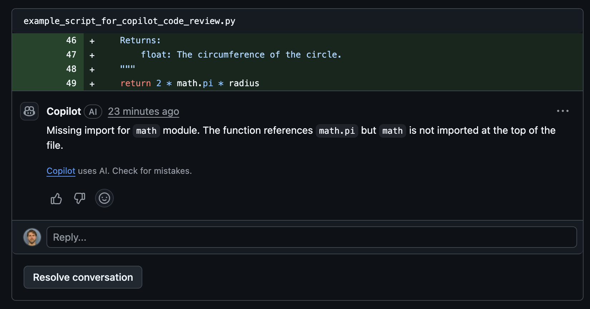
            * (problem 4) the math library is used but not imported
    


# References

* https://code.visualstudio.com/docs/copilot/overview
* https://docs.github.com/en/copilot/how-tos/configure-custom-instructions/add-repository-instructions
* https://github.blog/ai-and-ml/github-copilot/copilot-ask-edit-and-agent-modes-what-they-do-and-when-to-use-them/#:~:text=Ask%20mode:%20The%20quick%20gut,what%20I%20think%20this%20means.%E2%80%9D
* https://techcrunch.com/2025/08/22/coinbase-ceo-explains-why-he-fired-engineers-who-didnt-try-ai-immediately/