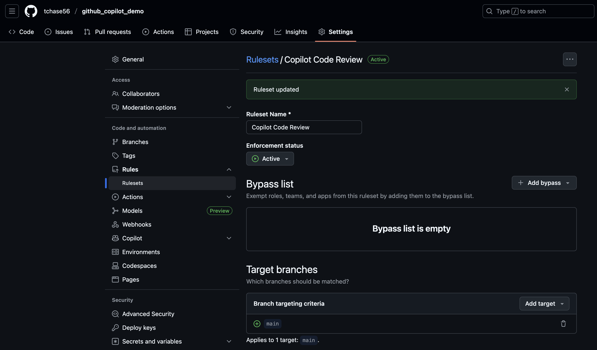
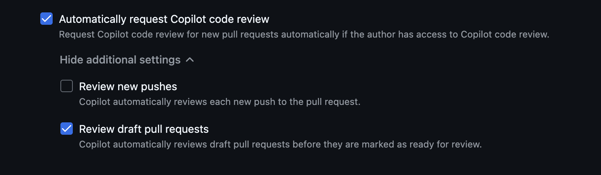

# Github Copilot Features

## Summary

GitHub Copilot is an AI-powered coding assistant integrated into Visual Studio Code. It provides code suggestions, explanations, and automated implementations based on natural language prompts and existing code context. Copilot has been trained on public code repositories and can assist with most programming languages and frameworks.

## Setup

### Download VSCode (macOS)

1. Go to the website and download for your appropriate computer system
    * https://code.visualstudio.com/
2. Open the downloaded file
3. Activate Temporary SUDO Access (if necessary)
    * Go to Fortune Brands Innovations Self Service
    * Click "All"
    * Click "MakeMeAdmin"
4. Drag VSCode from "Downloads" to "Applications"
5. Open VSCode

### Configure Github Copilot

1. Click on the Github Copilot button in the bottom right of VSCode and then click "Sign in to Use Copilot"
    * 
2. Sign in using Github
3. This will direct you to sign in through a browser

### Clone Repo and Open in VSCode
1. In the VSCode terminal navigate to the folder you want to contain your repository
2. Clone the repository
    * `git clone https://github.com/tchase56/github_copilot_demo.git`
3. In the VSCode File Explorer and select the cloned repository folder (github_copilot_demo)
    * 

### Set Up Python Environment

1. install UV in your system (macOS)
    * `brew install astral-sh/uv/uv`
2. Create virtual environment
    * `uv venv --python 3.11`
3. Activate virtual environment
    * `source .venv/bin/activate`
4. Install dependencies from uv.lock
    * `uv sync`

## Core Capabilities

### Code Completions

* Copilot provides inline code suggestions as you type, ranging from single line completions to entire function implementations. With next edit suggestions, it predicts the next logical code change based on your current context.

* Example
    * One of my favorite uses of this capability is that if I write a class or function in python and I include type hinting properly, I can autocomplete my entire docstring 

* Demo
    * If you'd like to start completely from scratch delete the version of add_floats() in codeComplete.py that already has the docstring. 
    * In codeComplete.py start typing your docstring and it should provide an option to autocomplete, you can accept the changes by clicking "tab". 
    * 

### Autonomous Coding

* VS Code and agent mode can autonomously plan and execute complex development tasks, coordinating multi-step workflows that involve running terminal commands or invoking specialized tools. 
* It can transform high-level requirements into working code.

* Example
    * One of my favorite uses of this capability is to highlight modular sections of my code and have an agent write unit tests (pytests). 

* Demo
    * If you'd like to recreate this demo, delete test_codeComplete.py. 
    * In codeComplete.py highlight the add_floats() function, then scroll over to the github copilot "CHAT" and type "Write pytests for this function". 
        * The highlighted function will be added as context to the LLM prompt. 
    * Github Copilot creates a set of pytests for the add_floats() function in a new file called "test_codeComplete.py". 
        * Click the checkmark to accept the changes suggested by Github Copilot. 
    * 

### Natural Language Chat

* Use natural language to interact with your codebase through chat interfaces. 
    * Ask questions, request explanations, or specify code changes using conversational prompts.
    * Apply changes across multiple files in your project using single prompts. 
    * Copilot analyzes your project structure and makes coordinated modifications.

* Examples
    * "How does authentication work in this project?"
    * "What's causing the memory leak in the data processing function?"
    * "Add error handling to the payment processing service"

* Demo
    * In test_codeComplete.py highlight the test_add_floats_precision() pytest and ask, "I don't fully understand this pytest. Can you explain it in detail?".
    * We can also ask follow ups such as, "What would happen without pytest.approx?". 
    * 

### Smart Actions

* VS Code has many predefined actions for common development tasks that are enhanced with AI capabilities and integrated into the editor.
    * From helping you write commit messages or pull requests descriptions, renaming code symbols, fixing errors in the editor, to semantic search that helps you find relevant files.

* Demo
    * If I add my generated pytests in test_codeComplete.py to the staged changes in the "Source Control" tab in VSCode I can click on the "generate commit message" button that looks like two stars. 
        * This will look at my staged changes and automatically suggest a relevant commit message. 
    * 

## Vibe Coding a Simple Video Game

### Writing a Simple Video Game

* If you want to recreate from scratch delete "minimalist_snake.py". 
* Go to the Github Copilot CHAT window and type, "Can you write a very simple minimalist video game in a new python file?". 
    * 
    * This is an example of the autonomous coding feature. 
* In the Github Copilot CHAT window type, "Can you explain this code in detail?". 
    * 
    * 
    * This is an example of the natural language chat feature. 
* Gameplay image "Snake"
    * 
        * This is an image of snake travelling downwards next to a piece of food.
* Bonus gameplay image "Space Invaders" (similarly vibe coded)
    * 
        * This is an image of the space invaders (M's) being shot at by the space ship (A). You can see a missed bullet (|) flying by the invaders. 

## Copilot Code Review

### Intro

Generally when you merge into a branch (such as main) you create a pull request and assign a reviewer to look at the changes to ensure there are not going to be any issues. In some cases only one person may be working on a repo, or in other cases there may be man power constraints that make extensive code review prohibitively painful. But Github Copilot is here to make our lives easier in this sense as well. We can have a Github Copilot agent conduct code reviews and suggest changes on pull requests.

* Types of Repository Custom Instructions
    * Repository-wide custom instructions
        * apply to all requests made in the context of a repository
        * Supported by: Copilot Chat, Copilot coding agent, and Copilot code review
        * specified in .github/copilot-instructions.md
    * Path-specific custom instructions
        * apply to requests made in the context of files that match a specified path
        * Supported by: Copilot coding agent, and Copilot code review
        * these are specified in one or more `NAME.instructions.md` files within `.github/instructions` directory in the repository. 
        * You can find more details in the following link
            * https://docs.github.com/en/copilot/how-tos/configure-custom-instructions/add-repository-instructions#creating-path-specific-custom-instructions-1
        * If the path you specify matches a file that Copilot is working on, and a repository-wide custom instructions file also exists, then the instructions from both files are used. 
    * Agent instructions 
        * used by AI agents
        * Supported by: Copilot coding agent
        * You can create one of more `AGENTS.md` files, stored anywhere within the repository. 
            * When Copilot is working, the nearest `AGENTS.md` file in the directory tree will take precedence. 

### Setup

1. On our branch of interest click "Settings" at the top, select "Copilot" on the left, and lastly click on "Code review".
2. Create a ruleset for when code review should be done. 
    * In our case we will do a code review if the user has access to copilot and if we are doing a pull request to main. 
    * 
        * name ruleset
        * set it to active
        * set target branch
    * 
        * toggle "review draft pull requests"
3. If "Use custom instructions when reviewing pull requests" is not toggled on
    * by default it will check for
        1. Code Quality & Readability
        2. Correctness & Bugs
        3. Security & Safety
        4. Performance
        5. Best Practices & Style
        6. Documentation & Maintainability
3. Under "General settings" toggle on "Use custom instructions when reviewing pull requests" if desired. 
    * 
    *  Create repository-wide custom instructions
        * Ask Copilot coding agent to generate `copilot-instructions.md` file
            1. Navigate to "Agents" page at github.com/copilot/agents
            2. Using the dropdown menu in the prompt field, select the repository you want Copilot to generate custom instructions for.
            3. Copy the following prompt, customizing it if needed:

                ```
                Your task is to "onboard" this repository to Copilot coding agent by adding a .github/copilot-instructions.md file in the repository that contains information describing how a coding agent seeing it for the first time can work most efficiently.

                You will do this task only one time per repository and doing a good job can SIGNIFICANTLY improve the quality of the agent's work, so take your time, think carefully, and search thoroughly before writing the instructions.

                <Goals>
                - Reduce the likelihood of a coding agent pull request getting rejected by the user due to
                generating code that fails the continuous integration build, fails a validation pipeline, or
                having misbehavior.
                - Minimize bash command and build failures.
                - Allow the agent to complete its task more quickly by minimizing the need for exploration using grep, find, str_replace_editor, and code search tools.
                </Goals>

                <Limitations>
                - Instructions must be no longer than 2 pages.
                - Instructions must not be task specific.
                </Limitations>

                <WhatToAdd>

                Add the following high level details about the codebase to reduce the amount of searching the agent has to do to understand the codebase each time:
                <HighLevelDetails>

                - A summary of what the repository does.
                - High level repository information, such as the size of the repo, the type of the project, the languages, frameworks, or target runtimes in use.
                </HighLevelDetails>

                Add information about how to build and validate changes so the agent does not need to search and find it each time.
                <BuildInstructions>

                - For each of bootstrap, build, test, run, lint, and any other scripted step, document the sequence of steps to take to run it successfully as well as the versions of any runtime or build tools used.
                - Each command should be validated by running it to ensure that it works correctly as well as any preconditions and postconditions.
                - Try cleaning the repo and environment and running commands in different orders and document errors and and misbehavior observed as well as any steps used to mitigate the problem.
                - Run the tests and document the order of steps required to run the tests.
                - Make a change to the codebase. Document any unexpected build issues as well as the workarounds.
                - Document environment setup steps that seem optional but that you have validated are actually required.
                - Document the time required for commands that failed due to timing out.
                - When you find a sequence of commands that work for a particular purpose, document them in detail.
                - Use language to indicate when something should always be done. For example: "always run npm install before building".
                - Record any validation steps from documentation.
                </BuildInstructions>

                List key facts about the layout and architecture of the codebase to help the agent find where to make changes with minimal searching.
                <ProjectLayout>

                - A description of the major architectural elements of the project, including the relative paths to the main project files, the location
                of configuration files for linting, compilation, testing, and preferences.
                - A description of the checks run prior to check in, including any GitHub workflows, continuous integration builds, or other validation pipelines.
                - Document the steps so that the agent can replicate these itself.
                - Any explicit validation steps that the agent can consider to have further confidence in its changes.
                - Dependencies that aren't obvious from the layout or file structure.
                - Finally, fill in any remaining space with detailed lists of the following, in order of priority: the list of files in the repo root, the
                contents of the README, the contents of any key source files, the list of files in the next level down of directories, giving priority to the more structurally important and snippets of code from key source files, such as the one containing the main method.
                </ProjectLayout>
                </WhatToAdd>

                <StepsToFollow>
                - Perform a comprehensive inventory of the codebase. Search for and view:
                - README.md, CONTRIBUTING.md, and all other documentation files.
                - Search the codebase for build steps and indications of workarounds like 'HACK', 'TODO', etc.
                - All scripts, particularly those pertaining to build and repo or environment setup.
                - All build and actions pipelines.
                - All project files.
                - All configuration and linting files.
                - For each file:
                - think: are the contents or the existence of the file information that the coding agent will need to implement, build, test, validate, or demo a code change?
                - If yes:
                   - Document the command or information in detail.
                   - Explicitly indicate which commands work and which do not and the order in which commands should be run.
                   - Document any errors encountered as well as the steps taken to workaround them.
                - Document any other steps or information that the agent can use to reduce time spent exploring or trying and failing to run bash commands.
                - Finally, explicitly instruct the agent to trust the instructions and only perform a search if the information in the instructions is incomplete or found to be in error.
                </StepsToFollow>
                   - Document any errors encountered as well as the steps taken to work-around them.
                ```
        4. Click "Send now"
            * Copilot will start a new session, which will appear in the list below the prompt box. 
            * Copilot will create a draft pull request, write your custom instructions, push them to the branch, then add you as a reviewer when it has finished, triggering a notification.
    * Writing your own `copilot-instructions.md` file
        1. In the root of your repository, create a file named `.github/copilot-instructions.md`.
            * Create the `.github` directory if it does not already exist.
        2. Add natural language instructions to the file, in Markdown format.
            * Whitespace between instructions is ignored, so the instructions can be written as a single paragraph, each on a new line, or separated by blank lines for legibility.


# References

* https://code.visualstudio.com/docs/copilot/overview
* https://docs.github.com/en/copilot/how-tos/configure-custom-instructions/add-repository-instructions